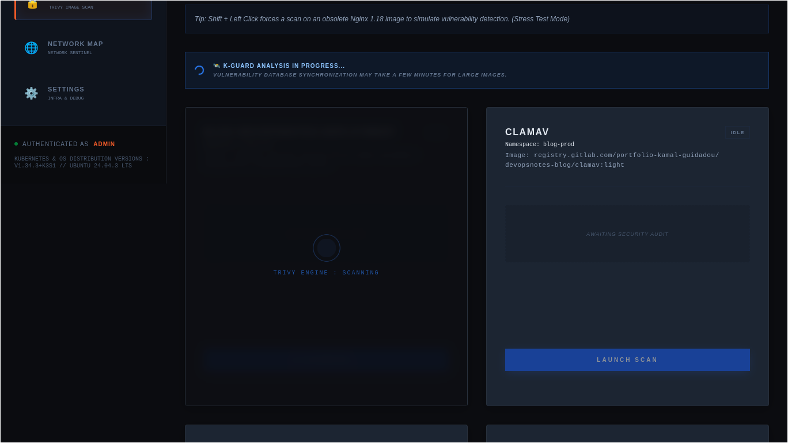
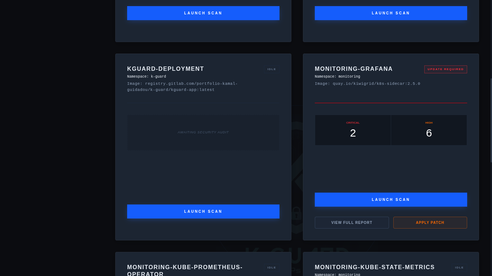
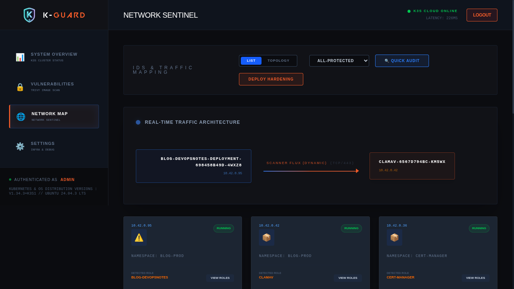
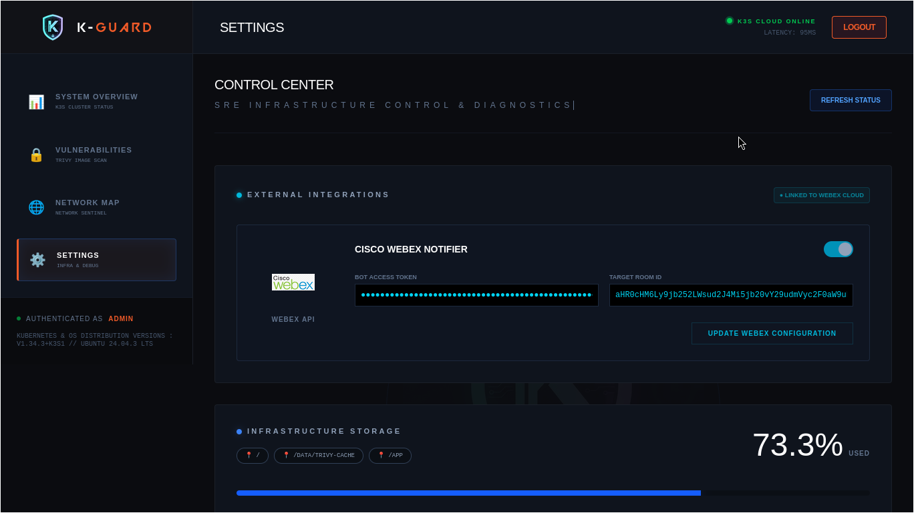
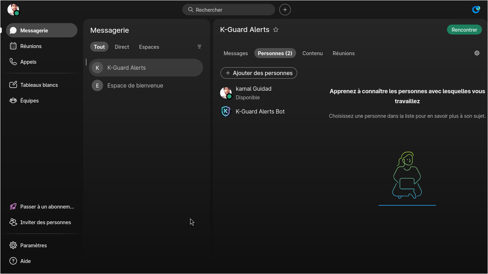
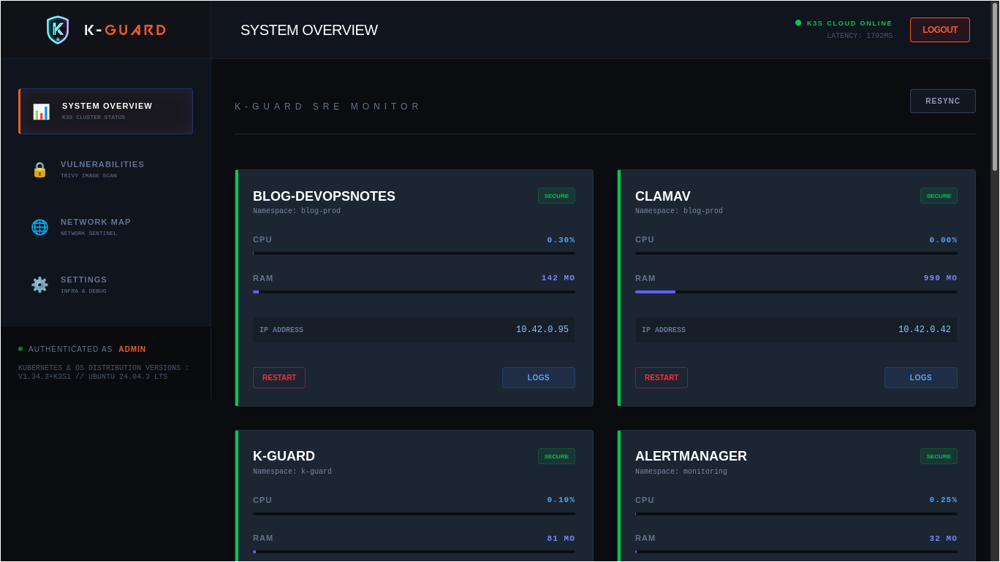
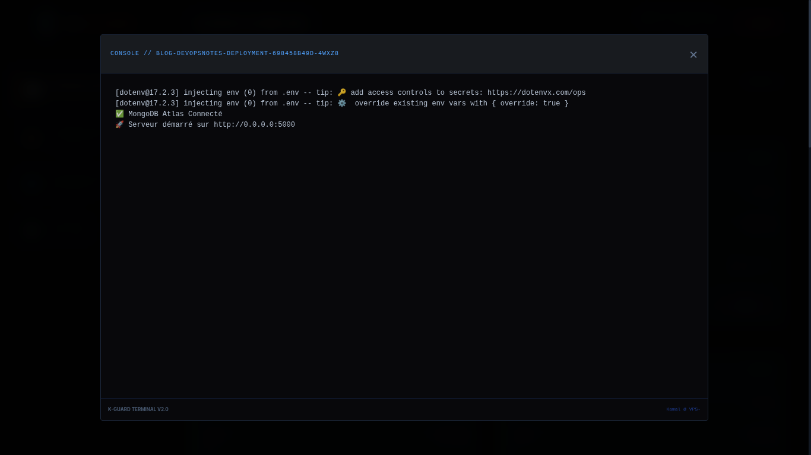
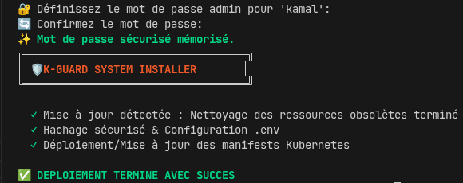
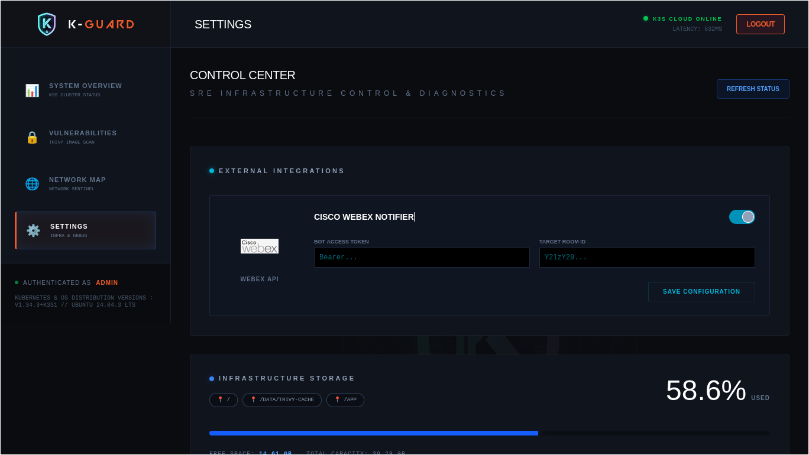
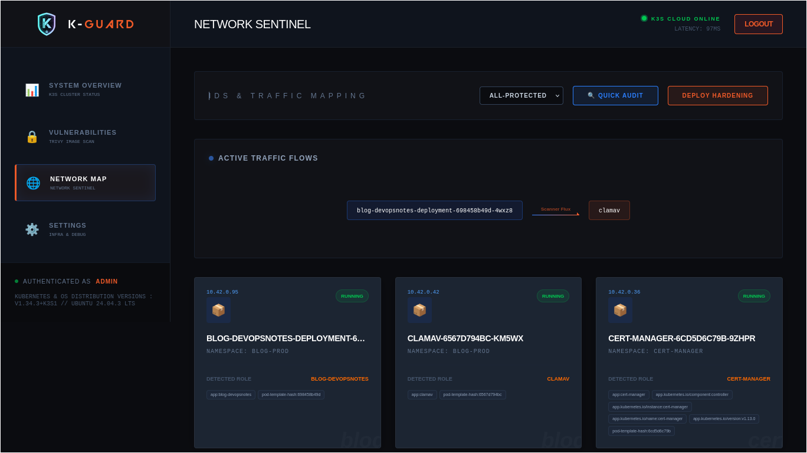

⚠️ Warning: Disclaimer

*K-Guard is engineered in alignment with industry security standards, following the [](https://www.bestpractices.dev/projects/12124). It is officially featured on the Cisco DevNet Code Exchange Platform [](https://developer.cisco.com/codeexchange/github/repo/KamouloxPelvis/K-Guard)*

*While security is a core priority, this software is provided as a personal and experimental Minimum Viable Product (MVP). It is designed as a research tool for exploring DevSecOps security architectures. As an evolving Open Source project, K-Guard is subject to continuous improvement and community-driven hardening.*

**K-Guard** is a security governance and observability platform for K3s clusters. It automates the full security lifecycle: Auditing (**Trivy**), Network Remediation (**Network Sentinel/Ansible**), and ChatOps Alerting (**Cisco Webex**).

---

## 📍 Summary

* [🧪 Tech Stack](#en-tech-stack)
* [🚀 Key Features](#en-key-features)
* [📖 API Documentation & Reference](#en-api-documentation--reference)
* [🛠️ Installation & Setup](#en-installation--setup)
    * [1. CLI Installer (Go)](#en-1-cli-installer-go)
    * [⚠️ CNI Recommendation](#en-network-isolation-recommendation)
    * [2. Auto-check & Dependencies](#en-2-auto-check--dependencies)
    * [3. Quick Install](#en-3-quick-start-procedure)
    * [4. K-Guard Management Console (SRE Ops)](#en-4-kguard-management-console)
    * [5. Accessing the Dashboard](#en-accessing-dashboard)
* [🛰️ Cisco Webex Integration](#en-cisco-webex-integration)
* [🛡️ Network Policy (Network Sentinel)](#en-network-policy--network-sentinel)
* [👤 Contact & Credits](#en-contact--credits)

---

## 🧪 <a name="en-tech-stack"></a>Tech Stack

* **Backend**: FastAPI (Python), Ansible Core, Trivy.
* **Frontend**: Vue.js 3, Tailwind CSS, Fetch, JWT Auth.
* **Installer**: Go (Bubble Tea / Lipgloss).

* **Created with**: Ubuntu 24.04 LTS, K3s, Kamatera VPS.

---

## 🚀 <a name="en-key-features"></a>Key Features

* **Trivy Security Engine**: Scans container images for vulnerabilities directly from the UI.





* **Network Sentinel**: Implements idempotent Zero-Trust NetworkPolicies via Ansible playbooks.



* **Cisco Webex ChatOps**: Real-time incident alerting with persistent integration settings in SQLite.





* **SRE Control Center**: Live monitoring of cluster latency, storage diagnostics, and pod health.





---

## 📖 API Documentation & Reference

K-Guard automatically generates interactive API documentation using **Swagger UI (OpenAPI 3.1)**. This allows developers and security auditors to explore and test all endpoints directly from the browser.

- **Interactive UI:** `https://<your-domain-or-ip>/docs`
- **Features documented:** - 🔍 K3s Infrastructure Metrics
  - 🔐 Authentication & Token management
  - 💓 System Health Checks (Liveness Probes)

> **Note:** Accessing the documentation via HTTPS is required. If using a self-signed certificate, you may need to bypass the browser security warning.

---

## 🛠️ <a name="en-installation--setup"></a>Installation & Setup



### <a name="en-1-cli-installer-go"></a>1. CLI Installer (Go)
Full stack deployment via a specialized **Go** installer:
* Checks system dependencies and Docker socket accessibility.
* Handles secure credential hashing with `bcrypt`.
* Syncs secrets to K3s and deploys core manifests.

### <a name="en-network-isolation-recommendation"></a>⚠️ *Network Isolation Recommendation (CNI)*
*To ensure strict micro-segmentation via Network Policies, implementing an advanced CNI (Calico, Cilium, Kube-router) is critical. Using the default Flannel CNI will keep the application functional, but East-West (inter-pod) filtering rules will be ignored by the cluster*.

### <a name="en-2-auto-check--dependencies"></a>2. Auto-check & Dependencies
The assistant launches a "Pre-flight check" script to validate the secure configuration of Docker and the K3s API. Host prerequisites:
* K3s (`curl -sfL https://get.k3s.io | sh -`).
* Docker (`sudo apt install docker.io -y`).
* Python 3 & Pip.

### <a name="en-3-quick-start-procedure"></a>3. Quick Install procedure

```bash
# Clone the repository
git clone [https://gitlab.com/portfolio-kamal-guidadou/k-guard.git](https://gitlab.com/portfolio-kamal-guidadou/k-guard.git)

cd installer (k-guard/installer)

# Grant execution rights
chmod +x install-kguard

# Launch installation
./install-kguard or sudo ./install-kguard
```
---

### 4. <a name="en-4-kguard-management-console"></a>K-Guard Management Console (SRE Ops)

To align with professional **SRE (Site Reliability Engineering)** standards, K-Guard deploys a global management command. This allows administrators to monitor and manage the infrastructure's health directly from the VPS terminal without navigating through complex directory structures.

| Command | Description | Context |
| :--- | :--- | :--- |
| **`kguard`** | **Primary entry point: Launch or verify K-Guard services.** | **Global Access** |
| `kguard status` | Displays the real-time status of the Systemd service and K3s connectivity. | Operational Health |
| `sudo kguard logs` | Streams live backend logs, including security audits and API hits. | Troubleshooting |
| `kguard k8s` | Fast access to Kubernetes resource diagnostics within the `k-guard` namespace. | Cluster Management |

**Example: Live Monitoring & Control**

```bash
# Launch management shortcut
kguard

# Monitor security events in real-time
sudo kguard logs
```

---

### <a name="en-accessing-dashboard"></a>5. Accessing the Dashboard
Once the deployment is finalized on your K3s cluster, the K-Guard interface is exposed through a secure endpoint.

1. **URL**: Open your browser and navigate to `http://VPS_IP:8445` (or the hostname configured in your local `/etc/hosts` with your VPS IP adress e.g : http://k-guard.local:8445).

2. **Authentication**: Use the administrative credentials defined during the installation process to log in and access the real-time Sentinel topology and security scans.

---

## 🛰️ <a name="en-cisco-webex-integration"></a>Cisco Webex Integration

Transform technical security audits into real-time operational alerts :
1.  **Enable**: Toggle the Webex notifier directly from the **Settings** panel.
2.  **Configure**: Enter your `Bot Access Token` and your `Target Room ID`.
3.  **Validate**: Settings are persisted in the `kguard.db` SQLite database only after a successful connectivity test.



---

## 🛡️ <a name="en-network-policy--network-sentinel"></a>Network Policy (Network Sentinel)

K-Guard enforces a **Zero-Trust** security posture by leveraging an automated, idempotent remediation engine powered by **Ansible Core**.

### ⚙️ The Hardening Engine (`harden_policies.yml`)
At the heart of the "Network Sentinel" lies a sophisticated Ansible playbook that orchestrates the cluster security lifecycle:
* **Auto-Discovery**: Dynamically scans the cluster to identify active namespaces and running workloads (excluding critical system namespaces).
* **Port Mapping**: Automatically extracts container ports from running pods to ensure that legitimate traffic is never interrupted during hardening.
* **Idempotent Deployment**: Uses the `kubernetes.core.k8s` module to ensure that the security state is always consistent with the desired policy, preventing configuration drift.

### 📄 Dynamic Templates (Jinja2)
K-Guard utilizes **Jinja2 templates** to generate context-aware security rules on the fly:
* **`core_baseline.j2`**: Implements the "Default Deny" foundation (Ingress/Egress isolation).
* **`app_internal_bridge.j2`**: Automatically links Ingress Controllers to discovered application ports.
* **`app_egress.j2`**: Hardened outbound rules for specific services (e.g., MongoDB Atlas, Cisco Webex API) using CIDR and Port filtering.
* **`audit_exception.j2`**: Secure "Diagnostic Corridors" allowing the K-Guard Sentinel to perform health checks without compromising the overall Zero-Trust stance.

### 🚀 UI-Driven Remediation (Settings)
Through the **"Deploy Hardening"** feature in the Settings panel, users can trigger the Ansible engine with a single click. This bridges the gap between high-level security intent and low-level YAML execution:
* **Visual Topology**: Real-time identification of vulnerable or isolated nodes.
* **One-Click Hardening**: Instantly applies the entire Ansible-driven security suite to the cluster.
* **Diagnostic Sentinel**: Integrated connectivity audit to verify that policies are effective but not disruptive.



---

## 👤 <a name="en-contact--credits"></a>Contact & Credits

© 2026 - **Kamal Guidadou** *DevSecOps, SRE & Cloud Security*

* 🌐 **Portfolio**: [https://portfolio.devopsnotes.org](https://portfolio.devopsnotes.org)
* ✍️ **Tech Blog**: [https://blog.devopsnotes.org](https://blog.devopsnotes.org)