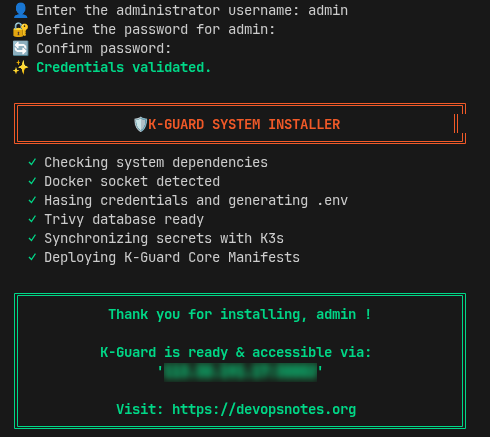

🇺🇸 [English Version](#english)

# 🛡️ <a name="french"></a>K-Guard: DevSecOps & SRE Orchestrator

**K-Guard** est une plateforme de gouvernance de sécurité et d'observabilité pour clusters K3s. Il automatise le cycle complet de la sécurité : Audit (**Trivy**), Remédiation réseau (**Network Sentinel/Ansible**) et Alerte ChatOps (**Cisco Webex**)

---

## 📍 Sommaire

* [🧪 Tech Stack](#-tech-stack)
* [🚀 Key Features](#-key-features)
* [🛠️ Installation & Setup](#-installation--setup)
    * [1. CLI Installer (Go)](#1-cli-installer-go)
    * [⚠️ Recommandation d'Isolation Réseau](#-recommandation-disolation-réseau-cni)
    * [2. Auto-check & Dépendances](#2-auto-check--dépendances)
    * [3. Procédure d'Amorçage Rapide](#3-procédure-damorçage-rapide)
    * [4. Infrastructure & RBAC](#4-infrastructure--rbac)
* [🛰️ Cisco Webex Integration](#-cisco-webex-integration)
* [🛡️ Network Policy (Network Sentinel)](#-network-policy--network-sentinel)
* [👤 Contact & Crédits](#-contact--crédits)

---

## 🧪 <a name="-tech-stack"></a>Tech Stack

* **Backend**: FastAPI (Python), Ansible Core, Trivy.
* **Frontend**: Vue.js 3, Tailwind CSS, Axios (JWT Auth).
* **Installer**: Go (Bubble Tea / Lipgloss).
* **OS/Infra**: Ubuntu 24.04 LTS, K3s, Kamatera VPS.

---

## 🚀 <a name="-key-features"></a>Key Features

* **Trivy Security Engine**: Scans container images for vulnerabilities directly from the UI.


* **Network Sentinel**: Implements idempotent Zero-Trust NetworkPolicies via Ansible playbooks.


* **Cisco Webex ChatOps**: Real-time incident alerting with persistent integration settings in SQLite.


* **SRE Control Center**: Live monitoring of cluster latency, storage diagnostics, and pod health.


---

## 🛠️ <a name="-installation--setup"></a>Installation & Setup



### <a name="1-cli-installer-go"></a>1. CLI Installer (Go)
Déploiement de la stack complète via un installateur spécialisé en **Go** :
* Vérification des dépendances système et accessibilité du socket Docker.
* Hachage sécurisé des credentials administrateur avec `bcrypt`.
* Synchronisation des secrets vers K3s et déploiement des manifestes core.

### <a name="-recommandation-disolation-réseau-cni"></a>⚠️ *Recommandation d'Isolation Réseau (CNI)*
*Pour garantir un cloisonnement étanche (Micro-segmentation) via les Network Policies, l'implémentation d'un CNI avancé (Calico, Cilium, Kube-router) est critique. L'utilisation du CNI Flannel par défaut laissera l'application fonctionnelle, mais les règles de filtrage Est-Ouest (inter-pods) seront ignorées par le cluster*.

### <a name="2-auto-check--dépendances"></a>2. Auto-check & Dépendances
L'assistant lance un script de "Pre-flight check" pour valider la configuration sécurisée de Docker et de l'API K3s. Pré-requis sur l'hôte :
* K3s (`curl -sfL https://get.k3s.io | sh -`).
* Docker (`sudo apt install docker.io -y`).
* Python 3 & Pip.

### <a name="3-procédure-damorçage-rapide"></a>3. Procédure d'Amorçage Rapide
```bash
# Récupération du dépôt
git clone [https://gitlab.com/portfolio-kamal-guidadou/k-guard.git](https://gitlab.com/portfolio-kamal-guidadou/k-guard.git)

cd k-guard/installer

# Accorder les droits d'exécution
chmod +x kguard-installer

# Lancer l'installation
./kguard-installer
```
---

### <a name="4-infrastructure--rbac"></a>4. Infrastructure & RBAC
* **Persistence**: Utilisation d'un `PersistentVolumeClaim` (PVC) de 5 Go pour le cache de la base Trivy, garantissant des scans récurrents ultra-rapides.
* **RBAC Policy**: Configuration d'un `ClusterRole` granulaire autorisant spécifiquement la lecture des métriques, le redémarrage de Pods et la gestion des `NetworkPolicies`.
* **Performance**: Limites de ressources optimisées pour un VPS Kamatera (Requêtes : 500m CPU / 1Gi RAM | Limites : 1.5 CPU / 2Gi RAM).

---

## 🛰️ <a name="-cisco-webex-integration"></a>Cisco Webex Integration

Transformez vos audits de sécurité techniques en alertes opérationnelles en temps réel :

1.  **Enable**: Activez le notificateur Webex directement depuis le panneau **Settings**.
2.  **Configure**: Renseignez votre `Bot Access Token` et votre `Target Room ID`.
3.  **Validate**: Les paramètres sont persistés dans la base SQLite `kguard.db` uniquement après un test de connectivité réussi.


---

## 🛡️ <a name="-network-policy--network-sentinel"></a>Network Policy ( Network Sentinel )

K-Guard applique une posture de sécurité Zero-Trust via des playbooks Ansible idempotents :

* **Default Deny**: Isolation globale entrante et sortante pour tous les namespaces protégés (exemples ici à remplacer par vos namespaces : `k-guard`, `blog-prod`, `portfolio-prod`, etc.).
* **Selective Egress**: Flux sortants autorisés uniquement vers les APIs critiques (Webex, Google Indexing, MongoDB Atlas) sur le port 443.
* **Visual Topology**: Cartographie dynamique du trafic et identification visuelle des nœuds vulnérables dans le cluster.


---

## 👤 <a name="-contact--crédits"></a>Contact & Crédits

© 2026 - **Kamal Guidadou** *DevSecOps, SRE & Cloud Security*

* 🌐 **Portfolio** : [https://portfolio.devopsnotes.org](https://portfolio.devopsnotes.org)
* ✍️ **Blog Cyber/Tech** : [https://blog.devopsnotes.org](https://blog.devopsnotes.org)


---


---

🇫🇷 [Version Française](#french)

# 🛡️ <a name="english"></a>K-Guard: DevSecOps & SRE Orchestrator

**K-Guard** is a security governance and observability platform for K3s clusters. It automates the full security lifecycle: Auditing (**Trivy**), Network Remediation (**Network Sentinel/Ansible**), and ChatOps Alerting (**Cisco Webex**).

---

## 📍 Summary

* [🧪 Tech Stack](#en-tech-stack)
* [🚀 Key Features](#en-key-features)
* [🛠️ Installation & Setup](#en-installation--setup)
    * [1. CLI Installer (Go)](#en-1-cli-installer-go)
    * [⚠️ Network Isolation Recommendation (CNI)](#en-network-isolation-recommendation)
    * [2. Auto-check & Dependencies](#en-2-auto-check--dependencies)
    * [3. Quick Start Procedure](#en-3-quick-start-procedure)
    * [4. Infrastructure & RBAC](#en-4-infrastructure--rbac)
* [🛰️ Cisco Webex Integration](#en-cisco-webex-integration)
* [🛡️ Network Policy (Network Sentinel)](#en-network-policy--network-sentinel)
* [👤 Contact & Credits](#en-contact--credits)

---

## 🧪 <a name="en-tech-stack"></a>Tech Stack

* **Backend**: FastAPI (Python), Ansible Core, Trivy.
* **Frontend**: Vue.js 3, Tailwind CSS, Axios (JWT Auth).
* **Installer**: Go (Bubble Tea / Lipgloss).
* **OS/Infra**: Ubuntu 24.04 LTS, K3s, Kamatera VPS.

---

## 🚀 <a name="en-key-features"></a>Key Features

* **Trivy Security Engine**: Scans container images for vulnerabilities directly from the UI.


* **Network Sentinel**: Implements idempotent Zero-Trust NetworkPolicies via Ansible playbooks.


* **Cisco Webex ChatOps**: Real-time incident alerting with persistent integration settings in SQLite.


* **SRE Control Center**: Live monitoring of cluster latency, storage diagnostics, and pod health.


---

## 🛠️ <a name="en-installation--setup"></a>Installation & Setup


### <a name="en-1-cli-installer-go"></a>1. CLI Installer (Go)
Full stack deployment via a specialized **Go** installer:
* Checks system dependencies and Docker socket accessibility.
* Handles secure credential hashing with `bcrypt`.
* Syncs secrets to K3s and deploys core manifests.

### <a name="en-network-isolation-recommendation"></a>⚠️ *Network Isolation Recommendation (CNI)*
*To ensure strict micro-segmentation via Network Policies, implementing an advanced CNI (Calico, Cilium, Kube-router) is critical. Using the default Flannel CNI will keep the application functional, but East-West (inter-pod) filtering rules will be ignored by the cluster*.

### <a name="en-2-auto-check--dependencies"></a>2. Auto-check & Dependencies
The assistant launches a "Pre-flight check" script to validate the secure configuration of Docker and the K3s API. Host prerequisites:
* K3s (`curl -sfL https://get.k3s.io | sh -`).
* Docker (`sudo apt install docker.io -y`).
* Python 3 & Pip.

### <a name="en-3-quick-start-procedure"></a>3. Quick Start Procedure
```bash
# Clone the repository
git clone [https://gitlab.com/portfolio-kamal-guidadou/k-guard.git](https://gitlab.com/portfolio-kamal-guidadou/k-guard.git)

cd k-guard/installer

# Grant execution rights
chmod +x kguard-installer

# Launch installation
./kguard-installer
```
---

### <a name="en-4-infrastructure--rbac"></a>4. Infrastructure & RBAC
* **Persistence**: Uses a 5GB `PersistentVolumeClaim` (PVC) for the Trivy database cache, ensuring ultra-fast recurrent scans.
* **RBAC Policy**: Granular `ClusterRole` configuration specifically allowing metrics retrieval, Pod remediation, and `NetworkPolicy` management.
* **Performance**: Resource limits optimized for a Kamatera VPS (Requests: 500m CPU / 1Gi RAM | Limits: 1.5 CPU / 2Gi RAM).

---

## 🛰️ <a name="en-cisco-webex-integration"></a>Cisco Webex Integration

Transform technical security audits into real-time operational alerts :
1.  **Enable**: Toggle the Webex notifier directly from the **Settings** panel.
2.  **Configure**: Enter your `Bot Access Token` and your `Target Room ID`.
3.  **Validate**: Settings are persisted in the `kguard.db` SQLite database only after a successful connectivity test.


---

## 🛡️ <a name="en-network-policy--network-sentinel"></a>Network Policy ( Network Sentinel )

K-Guard enforces a Zero-Trust security posture via idempotent Ansible playbooks :
* **Default Deny**: Global Ingress and Egress isolation for all protected namespaces (`k-guard`, `blog-prod`, `portfolio-prod`, etc.).
* **Selective Egress**: Authorized outgoing traffic only to critical APIs (Webex, Google Indexing, MongoDB Atlas) on port 443.
* **Visual Topology**: Dynamic traffic mapping and visual identification of vulnerable nodes within the cluster.


---

## 👤 <a name="en-contact--credits"></a>Contact & Credits

© 2026 - **Kamal Guidadou** *DevSecOps, SRE & Cloud Security*

* 🌐 **Portfolio**: [https://portfolio.devopsnotes.org](https://portfolio.devopsnotes.org)
* ✍️ **Tech Blog**: [https://blog.devopsnotes.org](https://blog.devopsnotes.org)